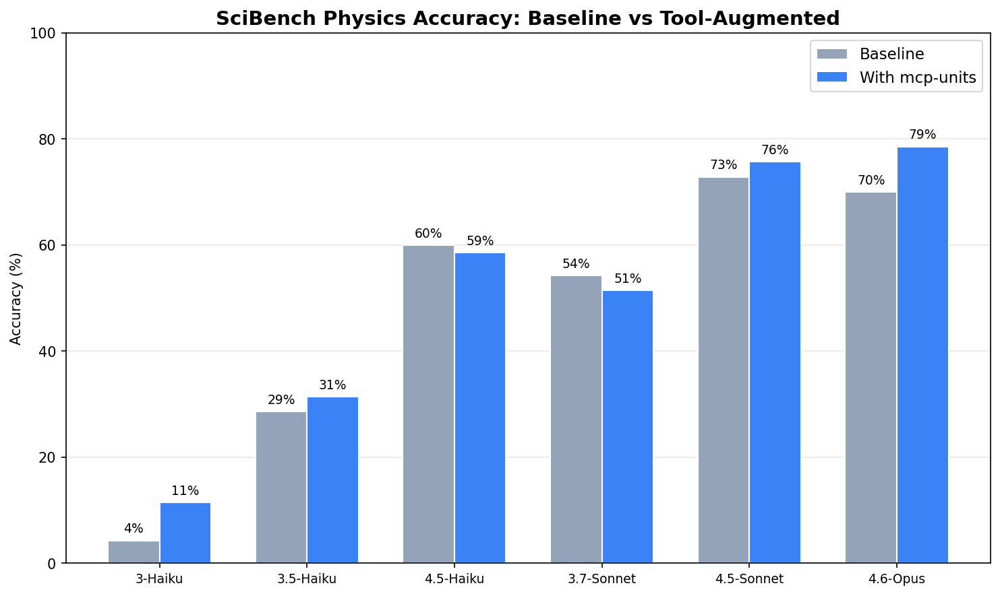

# mcp-units

An MCP server that provides deterministic unit conversions via [Pint](https://pint.readthedocs.io/). LLMs guess at unit conversions — this server makes them exact.

## What this does

Exposes 5 tools, 3 resources, and 2 prompts over the [Model Context Protocol](https://modelcontextprotocol.io/). Any MCP client (Claude Code, Claude Desktop, Cursor) can convert units, check dimensional compatibility, parse quantity strings, and simplify expressions — all backed by Pint's 400+ unit registry instead of LLM arithmetic.

## How it works

A [FastMCP](https://gofastmcp.com/) server wraps Pint's `UnitRegistry` and exposes it through MCP primitives:

- **Tools** — `convert`, `check_compatibility`, `parse_quantity`, `list_compatible_units`, `simplify`
- **Resources** — `units://systems`, `units://systems/{system}`, `units://dimensions`
- **Prompts** — `convert_document` (extract and convert all quantities in text), `check_calculations` (verify dimensional consistency)

The server runs over stdio by default (for Claude Code / Claude Desktop) or Streamable HTTP via `fastmcp run` (for remote / containerized deployment).

## Quickstart

### Prerequisites

- Python 3.12+
- [uv](https://docs.astral.sh/uv/)

### Install and run

```bash
git clone https://github.com/quantumleeps/mcp-units.git
cd mcp-units
uv sync
```

### Add to Claude Code

```bash
claude mcp add --transport stdio mcp-units -- \
  uv run --directory /path/to/mcp-units mcp-units
```

### Add to Claude Desktop

Add to `claude_desktop_config.json`:

```json
{
  "mcpServers": {
    "mcp-units": {
      "command": "uv",
      "args": ["run", "--directory", "/path/to/mcp-units", "mcp-units"]
    }
  }
}
```

### Run over HTTP

```bash
uv run fastmcp run src/mcp_units/server.py --transport http --port 8000
```

### Docker

```bash
docker build -t mcp-units .
docker run -p 8000:8000 mcp-units
```

### Tests

```bash
uv sync --all-extras
uv run pytest
```

## Evaluation

Does giving an LLM access to a unit conversion tool actually improve its accuracy on physics problems?



Evaluated on 70 SciBench college-level physics problems requiring 2+ unit types, across 6 Claude models (840 total runs). Opus 4.6 — the latest model — shows the largest gain (+8.6pp, 70.0% → 78.6%), suggesting that its combination of broad knowledge and refined tool-use lets it leverage unit conversion as a reliable augmentation. 4.5-Sonnet, a strong reasoner and tool user, also improves (+2.9pp). The older 3.7-Sonnet regresses (-2.9pp) — analysis shows it sometimes treats an intermediate conversion result as the final answer, or spins through repeated tool calls without converging, consistent with less mature tool-use capabilities. The surprise is 4.5-Haiku: same generation as 4.5-Sonnet with capable reasoning and tool use, yet it declines (-1.4pp). With a smaller model, the tool appears to be a distraction rather than an augmentation — the model has the sophistication to use it but not always the judgment to know when it helps. With only 70 problems and a single run per model, these per-model deltas carry real uncertainty — the 4.5-Haiku result in particular could reflect noise rather than a meaningful pattern.

### Next steps

- **Unit normalization** — Models write `cm3` but Pint needs `cm^3`. A lightweight `normalize_unit()` preprocessor plus better tool descriptions with formatting guidance would eliminate the 12 parsing failures observed in the eval.
- **Expression evaluation** — Models sometimes pass math expressions (`-1.602e-19 * 1.33e-39 / ...`) as the value parameter to `convert()`. Pint rejects these since it expects a float. Accepting and evaluating simple arithmetic expressions would let the tool handle intermediate calculations.
- **Offset unit handling** — Pint raises `OffsetUnitCalculusError` for °C and °F in compound expressions. The `parse_quantity` tool needs special handling for temperature offsets.
- **Larger problem set** — 70 problems demonstrates the evaluation framework but limits statistical confidence on per-model deltas. Run-to-run variance within a single model is also unknown. Expanding to 200+ problems with multiple runs per problem would quantify both effects.

### Run the eval

```bash
uv sync --group eval
uv run python -m eval.runner          # run all 6 models × 2 conditions (requires ANTHROPIC_API_KEY)
uv run python -m eval.visualize       # generate charts from results
uv run python -m eval.analyze         # print detailed analysis
```

## Project Structure

```
mcp-units/
  src/mcp_units/
    server.py       # FastMCP instance — tools, resources, prompts
    registry.py     # Pint UnitRegistry + compatible units workaround
    models.py       # Result dataclasses for structured tool output
  eval/
    runner.py       # Async eval runner — baseline vs tool-augmented
    problems.py     # SciBench problem loading (70 problems, 2+ unit types)
    scorer.py       # Answer extraction + 5% tolerance scoring
    mcp_tools.py    # FastMCP Client wrapper for tool execution
    results.py      # RunResult dataclass + JSON persistence
    visualize.py    # Grouped bar chart + error histograms
    analyze.py      # 16-section detailed analysis
  tests/
    test_tools.py   # 18 Pint logic tests
    test_server.py  # 17 MCP Client integration tests
  Dockerfile        # HTTP transport for containerized deployment
```

## Contributing

PRs welcome. Run `pre-commit install` after cloning and ensure `uv run pytest` passes before submitting.

## License

MIT
